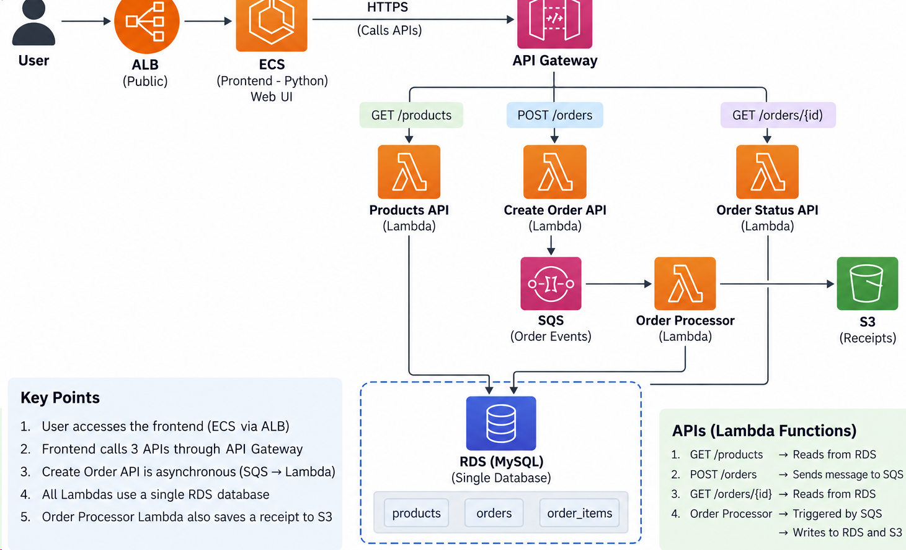

# ShopWave — Serverless E-Commerce on AWS



**Complete Build Guide (Steps 1–12)** · Region: `eu-west-2` (London)

A step-by-step runbook to build the full serverless application from scratch. Each
section below describes **one resource**: the heading tells you *what* you are creating,
and the block underneath lists *its properties*.

---

## Table of Contents

1. [Overview](#1-overview)
2. [Prerequisites](#2-prerequisites)
3. [Source Code](#3-source-code)
4. [Placeholders](#4-placeholders)
5. [Step 1 — RDS MySQL Database](#5-step-1--rds-mysql-database)
6. [Step 2 — Schema & Seed Data](#6-step-2--schema--seed-data)
7. [Step 3 — Secrets Manager Secret](#7-step-3--secrets-manager-secret)
8. [Step 4 — SQS Queue & S3 Bucket](#8-step-4--sqs-queue--s3-bucket)
9. [Step 5 — IAM Policy & Role](#9-step-5--iam-policy--role)
10. [Step 6 — Networking](#10-step-6--networking-security-groups--vpc-endpoints)
11. [Step 7 — Package Lambda Code](#11-step-7--package-the-lambda-code)
12. [Step 8 — Create the Lambdas](#12-step-8--create-the-four-lambda-functions)
13. [Step 9 — SQS Trigger](#13-step-9--wire-the-sqs-trigger)
14. [Step 10 — API Gateway](#14-step-10--api-gateway-http-api)
15. [Step 11 — Test the API](#15-step-11--test-the-api)
16. [Environment Variable Reference](#16-environment-variable-reference)
17. [Step 12 — Frontend on ECS + ALB](#17-step-12--frontend-on-ecs--alb)
18. [Verify the Live Site](#18-verify-the-live-site)

---

## 1. Overview

ShopWave is a serverless e-commerce application. A Python (Flask) frontend runs on
**ECS** behind an **ALB** and calls backend **Lambda** functions through **API
Gateway**. Order creation is asynchronous via **SQS**; an **Order Processor** Lambda
writes to **RDS (MySQL)** and stores receipts in **S3**.

```
User → ALB → ECS (Python UI) → API Gateway
        ├── GET  /products      → Products API (Lambda)     → RDS
        ├── POST /orders        → Create Order API (Lambda) → SQS ──┐
        └── GET  /orders/{id}   → Order Status API (Lambda) → RDS   │
                                                                    ▼
                    Order Processor (Lambda) ← SQS  →  writes RDS + S3 receipt
```

> **Scope:** Steps 1–11 build the **backend** (database, messaging, storage, four Lambdas,
> and the public API). Step 12 deploys the **frontend** (Flask) on ECS behind an ALB. All
> steps are complete.

**Components**

| Component | Service | Purpose |
|---|---|---|
| Database | RDS MySQL | Stores `products`, `orders`, `order_items` |
| Messaging | SQS | Decouples order creation (async) |
| Storage | S3 | Stores order receipts |
| Secrets | Secrets Manager | Holds DB credentials |
| Compute | Lambda ×4 | Products, Create Order, Order Status, Order Processor |
| API | API Gateway (HTTP API) | Public HTTPS endpoints for 3 Lambdas |
| Frontend | ECS (Fargate) + ALB | Flask web UI (Step 7) |

---

## 2. Prerequisites

- An AWS account with permission to create RDS, Lambda, IAM, VPC, SQS, S3, Secrets
  Manager, and API Gateway resources.
- An existing **VPC** with at least **two private subnets** in different AZs, and a
  route table associated with them.
- A **MySQL client** (e.g. MySQL Workbench) to load the schema.
- **Python 3** + **pip** (to package the Lambdas) and the **AWS CLI** (optional, for
  verification).
- The application **source code** (see next section).

---

## 3. Source Code

All application code lives in the Git repository:

```
GitHub repository:  <REPLACE-WITH-YOUR-GITHUB-REPO-URL>
```

> Replace the placeholder above once you push the code to GitHub.

**Repository layout**

```
serverless/
├── apis/
│   ├── products-api/        # GET  /products            → RDS
│   ├── create-order-api/    # POST /orders              → SQS
│   ├── order-status-api/    # GET  /orders/{id}         → RDS
│   └── order-processor/     # SQS-triggered             → RDS + S3
├── db/
│   ├── schema.sql           # products, orders, order_items
│   └── seed.sql             # sample catalog (8 products)
└── frontend/                # Flask web UI (Step 7 / ECS)
```

---

## 4. Placeholders

Replace these with your own values throughout:

| Placeholder | Meaning | Example used here |
|---|---|---|
| `<ACCOUNT_ID>` | 12-digit AWS account ID | `150390106962` |
| `<REGION>` | AWS region | `eu-west-2` |
| `<VPC>` | Your VPC | `dev-euw2-vpc` |
| `<PRIVATE_SUBNET_A/B>` | Two private subnets | `private-subnet-01 / 02` |
| `<RDS_ENDPOINT>` | RDS instance endpoint | `database-1.xxxx.eu-west-2.rds.amazonaws.com` |
| `<BUCKET>` | S3 receipts bucket | `shopwave-receipts-<ACCOUNT_ID>` |

---

## 5. Step 1 — RDS MySQL Database

The shared database all Lambdas read from and write to.

### 🗄️ Create: RDS database

```
Engine:               MySQL 8.0.x
Template:             Dev/Test (or Free tier)
DB instance id:       database-1
Master username:      admin
Master password:      <set-and-save-this>
Instance class:       db.t3.micro
Storage:              20 GB
VPC:                  <VPC>
Security group:       shopwave-db-sg   (new)
Public access:        No               (recommended)
Initial DB name:      shopwave
```

Wait until **Status = Available**, then record the **endpoint**.

> **Capacity errors** (`no subnets ... with sufficient capacity for ... gp3`) depend on
> the instance class × storage type × AZ. Switch the instance class (e.g. `db.t3.micro`)
> or storage type (`gp2` ↔ `gp3`) — capacity varies per AZ.
>
> RDS needs a **DB subnet group spanning ≥ 2 AZs**. Create subnets in two AZs first if
> none exist.

---

## 6. Step 2 — Schema & Seed Data

Connect to the RDS endpoint and run the two SQL scripts from the repo.

### 🧩 Apply: schema + seed

**Command line**

```bash
mysql -h <RDS_ENDPOINT> -u admin -p < db/schema.sql
mysql -h <RDS_ENDPOINT> -u admin -p shopwave < db/seed.sql
```

**MySQL Workbench**

1. `File → Open SQL Script → db/schema.sql → Execute`
2. `File → Open SQL Script → db/seed.sql → Execute`

> Workbench **safe update mode** blocks a `DELETE` without a keyed `WHERE`.
> `seed.sql` uses `TRUNCATE` for this reason, so it runs cleanly.

**Verify**

```sql
USE shopwave;
SHOW TABLES;                    -- products, orders, order_items
SELECT COUNT(*) FROM products;  -- 8
```

---

## 7. Step 3 — Secrets Manager Secret

The Lambdas fetch DB credentials from Secrets Manager at runtime.

### 🔐 Create: secret

```
Secret type:   Credentials for Amazon RDS database
Username:      admin
Password:      <master-password>
Database:      database-1   (select the RDS instance)
Secret name:   shopwave/db
```

**Ensure the secret JSON contains** (add `dbname` if missing):

```json
{
  "host": "<RDS_ENDPOINT>",
  "port": 3306,
  "username": "admin",
  "password": "********",
  "dbname": "shopwave"
}
```

> Record the **secret ARN** — the IAM policy in Step 5 references it, e.g.
> `arn:aws:secretsmanager:<REGION>:<ACCOUNT_ID>:secret:shopwave/db-XXXXXX`

---

## 8. Step 4 — SQS Queue & S3 Bucket

### 📨 Create: SQS queue

```
Type:                Standard
Name:                shopwave-orders
Visibility timeout:  180 seconds   (≥ 6× the processor Lambda timeout)
```

Record the **Queue URL**:

```
https://sqs.<REGION>.amazonaws.com/<ACCOUNT_ID>/shopwave-orders
```

### 🪣 Create: S3 bucket

```
Name:                  shopwave-receipts-<ACCOUNT_ID>   (globally unique)
Region:                <REGION>
Block public access:   ON
```

---

## 9. Step 5 — IAM Policy & Role

All four Lambdas share **one** execution role.

### 📜 Create: customer-managed policy

```
Name:   shopwave-lambda-policy
```

```json
{
  "Version": "2012-10-17",
  "Statement": [
    {
      "Sid": "ReadDbSecret",
      "Effect": "Allow",
      "Action": "secretsmanager:GetSecretValue",
      "Resource": "arn:aws:secretsmanager:<REGION>:<ACCOUNT_ID>:secret:shopwave/db-XXXXXX"
    },
    {
      "Sid": "SendAndConsumeOrders",
      "Effect": "Allow",
      "Action": [
        "sqs:SendMessage",
        "sqs:ReceiveMessage",
        "sqs:DeleteMessage",
        "sqs:GetQueueAttributes"
      ],
      "Resource": "arn:aws:sqs:<REGION>:<ACCOUNT_ID>:shopwave-orders"
    },
    {
      "Sid": "WriteReceipts",
      "Effect": "Allow",
      "Action": "s3:PutObject",
      "Resource": "arn:aws:s3:::shopwave-receipts-<ACCOUNT_ID>/*"
    }
  ]
}
```

### 👤 Create: execution role

```
Trusted entity:      AWS service → Lambda
Name:                shopwave-lambda-role
Attached policies:   shopwave-lambda-policy            (above)
                     AWSLambdaVPCAccessExecutionRole   (AWS-managed: Logs + VPC ENIs)
```

---

## 10. Step 6 — Networking (Security Groups & VPC Endpoints)

The DB-facing Lambdas run **inside the VPC**. Because the private subnets have **no NAT
gateway**, the Lambdas reach AWS services (SQS, Secrets Manager, S3) through **VPC
endpoints**.

### 🛡️ Create: security group — `shopwave-lambda-sg` (for the Lambdas)

```
Inbound:    none
Outbound:   Allow all   (default)
```

### 🛡️ Create: security group — `shopwave-vpce-sg` (for the interface endpoints)

```
Inbound:    HTTPS (443)  FROM  shopwave-lambda-sg
Outbound:   Allow all    (default)
```

### 🔌 Create: VPC endpoints

```
S3               Type: Gateway     Attach to the private route table. No SG. (Free)
SQS              Type: Interface   Subnets: both private   SG: shopwave-vpce-sg   Private DNS: ✓
Secrets Manager  Type: Interface   Subnets: both private   SG: shopwave-vpce-sg   Private DNS: ✓
```

- SQS service name: `com.amazonaws.<REGION>.sqs`
- Secrets Manager service name: `com.amazonaws.<REGION>.secretsmanager`

> **Private DNS must be enabled** on interface endpoints so the standard service
> hostnames resolve to the private endpoint — no code change needed.

### 🔑 Update: RDS security group (allow Lambda → RDS)

```
Add inbound rule →   Type: MySQL/Aurora (3306)   Source: shopwave-lambda-sg
```

> **Two control planes, don't confuse them:** Security Groups = *network reachability*
> (RDS, endpoints); IAM = *API permission* (Secrets, SQS, S3). A Lambda needs **both**.

---

## 11. Step 7 — Package the Lambda Code

Three functions import **`pymysql`** (not in the Lambda runtime) and must **bundle** it.
`boto3` is already in the runtime, so it is **not** bundled. One zip per function.

```bash
# From the repo root. Build the three DB-facing functions (bundle pymysql):
for fn in products-api order-status-api order-processor; do
  build=$(mktemp -d)
  cp apis/$fn/handler.py "$build/"
  pip install --target "$build" pymysql==1.1.1
  (cd "$build" && zip -qr "$OLDPWD/$fn.zip" . -x '*__pycache__*')
done

# create-order-api needs no extra libraries (boto3 only):
(cd apis/create-order-api && zip -qr "$OLDPWD/create-order-api.zip" handler.py)
```

> `handler.py` must sit at the **root** of each zip so the handler string
> `handler.lambda_handler` resolves.

---

## 12. Step 8 — Create the Four Lambda Functions

### λ Create: each Lambda (common settings)

```
Runtime:          Python 3.12
Architecture:     x86_64
Execution role:   shopwave-lambda-role   (existing)
Handler:          handler.lambda_handler
Memory:           128 MB
VPC:              <VPC>
Subnets:          both private subnets
Security group:   shopwave-lambda-sg
Code:             upload the matching .zip
```

### λ Per-function settings

**`shopwave-products-api`**
```
Zip:      products-api.zip
Timeout:  15s
Env:      DB_SECRET_NAME = shopwave/db
```

**`shopwave-order-status-api`**
```
Zip:      order-status-api.zip
Timeout:  15s
Env:      DB_SECRET_NAME = shopwave/db
```

**`shopwave-create-order-api`**  *(no RDS — SQS only)*
```
Zip:      create-order-api.zip
Timeout:  15s
Env:      ORDER_QUEUE_URL = https://sqs.<REGION>.amazonaws.com/<ACCOUNT_ID>/shopwave-orders
```

**`shopwave-order-processor`**  *(SQS-triggered)*
```
Zip:      order-processor.zip
Timeout:  30s
Env:      DB_SECRET_NAME = shopwave/db
          RECEIPT_BUCKET = shopwave-receipts-<ACCOUNT_ID>
```

> Keep timeouts generous — a VPC cold start + Secrets + RDS connect can exceed the 3s
> default. You are billed for **actual run time**, not the timeout.

### 🧪 Test each Lambda directly (before API Gateway)

Invoke each function with a sample event to confirm it works in isolation. This proves
the VPC networking, VPC endpoints, IAM role, and RDS/SQS/S3 access independently of API
Gateway. (`--cli-binary-format raw-in-base64-out` lets you pass a plain-JSON payload.)

```bash
export AWS_PROFILE=<profile> AWS_REGION=<REGION>

# products-api  →  200 with the product list
aws lambda invoke --function-name shopwave-products-api \
  --payload '{}' --cli-binary-format raw-in-base64-out out.json && cat out.json

# order-status-api  →  404 for a missing id (proves it queried RDS)
aws lambda invoke --function-name shopwave-order-status-api \
  --payload '{"pathParameters":{"id":"ORD-DOESNOTEXIST"}}' \
  --cli-binary-format raw-in-base64-out out.json && cat out.json

# create-order-api  →  202 with an order_id (pushes a message to SQS)
aws lambda invoke --function-name shopwave-create-order-api \
  --payload '{"body":"{\"customer\":{\"name\":\"Test\",\"email\":\"t@example.com\"},\"items\":[{\"product_id\":1,\"name\":\"Aurora Wireless Headphones\",\"price\":129.99,\"quantity\":2}],\"idempotency_key\":\"test-1\"}"}' \
  --cli-binary-format raw-in-base64-out out.json && cat out.json

# order-processor  →  {"batchItemFailures": []}  (writes RDS + S3)
aws lambda invoke --function-name shopwave-order-processor \
  --payload '{"Records":[{"messageId":"m1","body":"{\"order_id\":\"ORD-TESTPROC01\",\"status\":\"PENDING\",\"customer\":{\"name\":\"Proc Test\"},\"items\":[{\"product_id\":3,\"name\":\"Solstice Smartwatch\",\"price\":199.00,\"quantity\":1}],\"total\":199.00,\"idempotency_key\":\"proc-1\",\"created_at\":\"2025-01-01T00:00:00+00:00\"}"}]}' \
  --cli-binary-format raw-in-base64-out out.json && cat out.json
```

Verify the processor's writes:

```bash
# receipt in S3
aws s3 ls s3://shopwave-receipts-<ACCOUNT_ID>/receipts/

# order row in RDS (via order-status-api)  →  200, status COMPLETED
aws lambda invoke --function-name shopwave-order-status-api \
  --payload '{"pathParameters":{"id":"ORD-TESTPROC01"}}' \
  --cli-binary-format raw-in-base64-out out.json && cat out.json
```

---

## 13. Step 9 — Wire the SQS Trigger

Connect the queue to the Order Processor so orders are consumed automatically.

### 🔗 Add: SQS trigger (on `shopwave-order-processor`)

```
Source:                      SQS
Queue:                       shopwave-orders
Batch size:                  10
Report batch item failures:  ✓   (the code returns batchItemFailures)
```

---

## 14. Step 10 — API Gateway (HTTP API)

Expose the three HTTP-facing Lambdas. The **Order Processor is NOT added here** — it is
triggered by SQS, not HTTP.

### 🌐 Create: HTTP API

```
Name:     shopwave-api
Stage:    $default   (Auto-deploy: ✓)
```

### 🌐 Create: routes (each attached to a Lambda integration)

```
GET   /products      →  shopwave-products-api
POST  /orders        →  shopwave-create-order-api
GET   /orders/{id}   →  shopwave-order-status-api
```

Record the **Invoke URL** — this is the frontend's `API_BASE_URL`:

```
https://<api-id>.execute-api.<REGION>.amazonaws.com
```

> - A **route** is the incoming pattern (method + path); an **integration** is the
>   backend it calls. Each route attaches to one integration.
> - `{id}` in `/orders/{id}` arrives at the Lambda as `event.pathParameters.id`.
> - **CORS not needed** — the frontend calls the API server-side.

---

## 15. Step 11 — Test the API

Replace `<API>` with your Invoke URL host.

```bash
# List products  →  HTTP 200, 8 products
curl -s "https://<API>/products" | jq

# Place an order  →  HTTP 202 with an order_id
curl -s -X POST "https://<API>/orders" \
  -H "Content-Type: application/json" \
  -d '{"customer":{"name":"Test","email":"t@example.com"},
       "items":[{"product_id":1,"name":"Aurora Wireless Headphones",
                 "price":129.99,"quantity":2}],
       "idempotency_key":"key-1"}'

# Look up that order after a moment  →  HTTP 200, status COMPLETED
curl -s "https://<API>/orders/ORD-XXXXXXXX" | jq
```

A successful `POST /orders` places a message on SQS; the Order Processor consumes it,
writes the order to RDS, and stores a receipt in S3. `GET /orders/{id}` then returns the
order with `status = COMPLETED` and a `receipt_url`.

---

## 16. Environment Variable Reference

| Function | Variable | Value |
|---|---|---|
| products-api | `DB_SECRET_NAME` | `shopwave/db` |
| order-status-api | `DB_SECRET_NAME` | `shopwave/db` |
| create-order-api | `ORDER_QUEUE_URL` | `https://sqs.<REGION>.amazonaws.com/<ACCOUNT_ID>/shopwave-orders` |
| order-processor | `DB_SECRET_NAME` | `shopwave/db` |
| order-processor | `RECEIPT_BUCKET` | `shopwave-receipts-<ACCOUNT_ID>` |

---

## 17. Step 12 — Frontend on ECS + ALB

Deploys the Flask frontend (`frontend/`) onto ECS (Fargate) behind an ALB.

> **Networking note:** the VPC has no NAT gateway, so run the Fargate **tasks in the
> public subnets with a public IP** (so they can pull the image from ECR and reach API
> Gateway), and put the ALB in the public subnets too. The public subnets route
> `0.0.0.0/0` → the Internet Gateway.

### 📦 Create: ECR repository + push image

```
Repository:   shopwave-frontend
```

```bash
export AWS_PROFILE=<profile> AWS_REGION=<REGION>
ACC=<ACCOUNT_ID>; REPO=shopwave-frontend
REG=$ACC.dkr.ecr.$AWS_REGION.amazonaws.com

aws ecr create-repository --repository-name $REPO --image-scanning-configuration scanOnPush=true
aws ecr get-login-password | docker login --username AWS --password-stdin $REG

cd frontend
docker build --platform linux/amd64 -t $REPO:v1 .
docker tag $REPO:v1 $REG/$REPO:v1
docker push $REG/$REPO:v1
```

> Build with `--platform linux/amd64` to match the Fargate x86_64 runtime.

### 🐳 Create: ECS cluster

```
Name:            shopwave-cluster
Infrastructure:  AWS Fargate (serverless)
```

### 👤 Prerequisite: ECS task execution role

```
Role:      ecsTaskExecutionRole
Policy:    AmazonECSTaskExecutionRolePolicy   (ECR pull + CloudWatch Logs)
```

> Most accounts already have this role. If not, create it (trusted entity:
> `ecs-tasks.amazonaws.com`) and attach the managed policy above.

### 📋 Create: task definition

```
Family:              shopwave-frontend
Launch type:         AWS Fargate
OS/Arch:             Linux/X86_64
Task size:           0.25 vCPU, 0.5 GB
Task role:           None   (frontend only calls API Gateway over HTTPS)
Execution role:      ecsTaskExecutionRole
Container name:      shopwave-frontend
Image URI:           <ACCOUNT_ID>.dkr.ecr.<REGION>.amazonaws.com/shopwave-frontend:v1
Port mapping:        8080 / TCP
Log collection:      CloudWatch (auto log group /ecs/shopwave-frontend)
Env:                 API_BASE_URL = <API Gateway Invoke URL>
                     MOCK_MODE    = false
                     SECRET_KEY   = <random-string>
                     API_TIMEOUT  = 10        (optional; see note below)
```

> Generate a `SECRET_KEY`: `python3 -c "import secrets; print(secrets.token_hex(32))"`
>
> **Cold-start tip:** the DB Lambdas run in the VPC; a cold start (VPC ENI + Secrets +
> RDS connect) can exceed the frontend's default 5s timeout, causing an occasional
> "Read timed out" on the very first request. Set **`API_TIMEOUT=10`** to avoid it, or
> use Lambda provisioned concurrency. Warm calls return in well under a second.

### 🛡️ Create: security groups

```
shopwave-alb-sg   (the load balancer)
    Inbound:   HTTP (80)        FROM 0.0.0.0/0
    Outbound:  Allow all

shopwave-ecs-sg   (the Fargate tasks)
    Inbound:   Custom TCP 8080  FROM shopwave-alb-sg     (SG-to-SG, not a CIDR)
    Outbound:  Allow all
```

> The internet reaches only the ALB (port 80); the ALB reaches the tasks (port 8080).
> The tasks are never directly reachable from the internet, even with a public IP,
> because their inbound rule only permits the ALB's security group.

### 🚀 Create: ECS service (with a new ALB)

The ECS "Create service" wizard can create the ALB, listener, and target group inline.

```
── Deployment ─────────────────────────────
Cluster:            shopwave-cluster
Compute:            Fargate
Task definition:    shopwave-frontend : 1
Service name:       shopwave-frontend-svc
Desired tasks:      1

── Networking ─────────────────────────────
VPC:                <VPC>
Subnets:            BOTH public subnets
Security group:     shopwave-ecs-sg
Public IP:          ENABLED            (required — no NAT)

── Load balancing ─────────────────────────
Type:               Application Load Balancer → Create new
ALB name:           shopwave-alb        (internet-facing)
ALB security group: shopwave-alb-sg
Listener:           HTTP : 80
Target group:       shopwave-tg   (type: IP addresses, HTTP : 8080)
Health check path:  /health
```

> - Target group type must be **IP addresses** (Fargate/`awsvpc` registers by IP).
> - **Watch out:** the wizard may default the ALB and/or tasks to the VPC's **`default`
>   security group**. After creating, confirm the ALB uses `shopwave-alb-sg` and the
>   service uses `shopwave-ecs-sg` — reassign if needed (EC2 → Load Balancers → Security,
>   and ECS → Update service → Networking).

---

## 18. Verify the Live Site

The ALB gives you a public DNS name:

```
http://<ALB_DNS>.<REGION>.elb.amazonaws.com
```

1. Wait for the service to reach **1/1 running** and the target group to show **healthy**
   (first task takes 1–3 min).
2. Open the ALB URL — the storefront loads.

**Confirm it is serving real data (not mock):**

- The product list is not proof on its own (the seed data mirrors the old mock data).
- Use **Track order** with a made-up reference (e.g. `ORD-FAKE99999`) → real returns
  *not found*; mock would fabricate an order.
- Track a real order → returns its actual RDS data (status `COMPLETED`, real items/total).
- Or add a row to `products` in RDS and refresh — it appears in the catalog (mock cannot
  reflect DB changes). There is no "add product" page; the catalog is read-only and
  managed directly in the database.

**Full request path when the site is live:**

```
Browser → ALB → ECS (Flask) → API Gateway → Lambda → RDS / SQS / S3
```

---

*End of build guide — all 12 steps complete (backend + frontend).*
